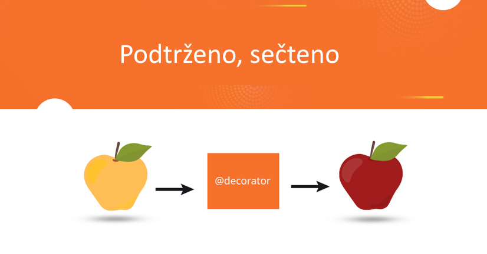

# Python a Decorators

###### Autor: Lukáš Pinkava, 7.AV

## Co jsou Decorators zač?
**Decorators** (čes. *dekorátory*) jsou funkce, které mění chování funkce bez nutnosti měnit jejich kód.
Pro představu: vezmeš funkci, "zabalíš" ji do jiné funkce, která následně přidá něco navíc (např. logování nebo měření času).

### Stručná historie
Dekorátory jsou s námi od verze Pythonu 2.4 (někdy rok 2004). 
Pyhton dekorátory tedy vznikly hlavně kvůli čitelnosti a lepšímu zápisu metaprogramování.


## Ukázka bez dekorátoru
```python
def pozdrav():
    print(f"Zdra-")
    print(f"vím!")
pozdrav()
```
```yaml
Zdra-
vím!
```

## Ukázka s dekorátorem
```python
def muj_dekorator(funkce):
    def obal():
        print(f"Před zavoláním funkce")
        funkce()
        print(f"Po zavolání funkce")
    return obal
```
## Názorná ukázka
```python
@muj_dekorator
def pozdrav():
    print(f"Zdra-")
    print(f"vím!")
pozdrav()
```


#### + výstup v terminálu
```yaml
Před voláním funkce
Zdra-
vím!
Po volání funkce
```

## Co se děje?
Toto:
```python
@muj_dekorator
def pozdrav():
    print(f"Zdra-")
    print(f"vím!")
```

je jen složitě zapsané toto:

```python
pozdrav = muj_dekorator(pozdrav)
```

# Praktické využití dekorátorů
Dekorátory se často používají na:

## Měření času
```python
import time

def mer_cas(f):
    def obal():
        start = time.time()
        f()
        print("Trvalo to:", time.time() - start, "s")
    return obal

@mer_cas
def vypocet():
    time.sleep(1)
    print("Hotovo!")

vypocet()
```

```yaml
Zdra-
vím!
Před zavoláním funkce
Zdra-
vím!
Po zavolání funkce   
Hotovo!
Trvalo to: 1.0004768371582031 s
```

## Logování
**Logování** je zapisování informací o tom, co se v programu děje.
Třeba kdy se spustí funkce, s jakými argumenty, nebo jaký vrátí výsledek.
Pomáhá to:

- při ladění (debugging)
- při sledování chyb
- při bezpečnostních kontrolách

### Jak tady pomáhá dekorátor?
Dekorátor dokáže obklopit funkci logovací logikou, aniž bychom měnili její kód.

### Názorná ukázka
Řekněme, že chceme logovat, kdy se funkce spustí.
```python 
def logovani(funkce):
    def obal():
        print(f"Spouštím funkci: {funkce.__name__}")
        vysledek = funkce()
        print(f"Funkce {funkce.__name__} dokončena")
        return vysledek
    return obal

@logovani
def pozdrav():
    print("Ahoj")

pozdrav()
```
#### Výstup
```yaml
Spouštím funkci: pozdrav
Ahoj
Funkce pozdrav dokončena
```

### Co tady dekorátor dělá?
✔ Nezasahuje do funkce pozdrav()

✔ Přidává kolem ní logování

✔ Když zítra upravíš logování, funkce tím neutrpí

### Výhody
| Výhody                                 | Proč na tom záleží               |
| -------------------------------------- | -------------------------------- |
| Neměníš původní kód funkcí             | bezpečnější a čistější vývoj     |
| Opakovaně použitelné                   | jeden dekorátor → logování všude |
| Může posílat logy do souboru, serveru… | profesionální monitoring         |

### Nevýhody
| Nevýhoda                    | Proč na tom záleží                                      |
| --------------------------- | ------------------------------------------------------- |
| Můžou ztížit čitelnost kódu | Chování funkce není přímo v jejím těle                  |
| Mění metadata funkce        | Bez `wraps` ztratí funkce jméno, typy, dokumentaci      |
| Složitější pro začátečníky  | Začátečníci nechápou, co se děje „v zákulisí“           |

## Meme na závěr
