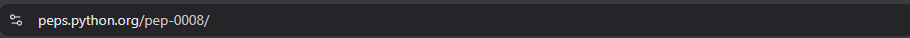

# PEP8 (Python Enhancement Proposal) 
### Oficiální stránka PEP8:

## Obsah:
###     
1. **Co je to PEP8?**
###     
2. **Pojmenovávací konvence**
###     
3. **Typy formátování (komentáře, odsazení, apod.)**
###
## **Co je PEP8?**
### 
- Pep8 je oficiální stylový průvodce pro programátory pracující v programovacím jazyce Python.
### 
- Jeho cílem je vylepšit čitelnost a konzistentost veškerého napsaného kódu v tomto jazyce.
###
- Číslo 8 má PEP8 právě z toho důvodu, že se zabývá zlepšením stylu psaní syntaxe jazyka python.
###
## **Pojmenovávací konvence**
#### 
V praxi je samozdřejmě nejdůležitější vědět, jaké jmenovací konvence PEP8 navrhuje. Níže máte uvedených **pět nejdůležitějších** názvových konvencí:
###
####
1. ### Proměnné
    

2. ### Funkce
3. ### Třídy
4. ### Konstanty
5. ### Moduly a soubory


### 1. Proměnné
 **Styl:** `lower_case_with_underscores`  
 **Příklad:**
```python
user_name = "Alice"
max_value = 100
```
 **Poznámka:** Podle PEP8 by se měli používat malé písmena a slova oddělovat podtržítky **_**

### 2. Funkce
 **Styl:** `lower_case_with_underscores`  
 **Příklad:**
```python
def calculate_total(price, tax):
    return price + tax
```
 **Poznámka:** Podle PEP8 platí to samé co pro **Proměnné** i pro funkce. (malé písmena a slova oddělovaná podtržítky) **_**


### 3. Třídy
 **Styl:** `CamelCase(tzv. PascalCase)`  
 **Příklad:**
```python
class BankAccount:
    pass
```
**Poznámka:** Podle PEP8 platí, že třídy by se měli pojmenovávat s prvními písmeny velkými a bez mezer.

### 4. Konstanty
 **Styl:** `upper_case_with_underscores`  
 **Příklad:**
```python
MAX_RETRIES = 5
DEFAULT_TIMEOUT = 30
API_URL = "https://github.com/mgvsetin/PythonWork2027_01"
```
**Poznámka:** Podle PEP8 platí, že konstanty by se měli psát s **CAPS LOCKEM** a mezery mezi slovy oddělovat podtržítkem **_**. Zároveň platí, že konstanty by se měli definovat hned na začátku programu (hned pod zahrnutím všech potřebných knihoven), abychom dali najevo že se jejich hodnoty nemají měnit. **pozn: Python technicky žádné konstanty nemá, protože je to dynamický jazyk. (kromě klíčových slov jako jsou True, False či None, které mají chráněné hodnoty**


### 5. Moduly a Soubory
 **Styl:** `snake_case`  
 **Příklad:**
```python
def load_data(path):
    with open(path, "r") as f:
        return f.read()
```
**Poznámka:** Podle PEP8 se názvy modulů i souborů mají psát malými písmeny a slova mají být oddělována zas a znovu podtržítky _.

## **Typy Formátování**
#### 
PEP8 definuje několik základních pravidel pro formátování kódu a věcí jako jsou: **odsazování, komentáře, maximální délka řádku apod.**
###
### 1) Odsazování
 - V Pythonu máme podle PEP8 používát **4 mezery** na úroveň odsazení **(nikoliv tabulátor)**   
 **Příklad:**
```python
def long_function_name(var_one, var_two,
                       var_three, var_four):
    print(var_one)
```
**Poznámka:** *print(var_one)* je zde odsazen přesně čtyřmi mezerami, což je přesně to co po nás PEP8 chce.

### 2) Komentáře
 - V Pythonu máme v zásadě 3 typy komentářů (**Řádkové, Blokové, Docstringy**)
 - **Řádkové komentáře** máme podle PEP8 začínat hashtagem (#) a mají být za řádkem, který komentují. Cílem je samozdřejmě jejich srozumitelnost a hlavně **aktuálnost**, nesmí obsahovat zastaralé informace.  
  - **Blokové komentáře** Měli by popisovat větší části kódu a být tak tvořeny **z více řádků**, které by měli být odsazeny od kraje stejně jako kód, který popisují.  
   - **Docstringy** Slouží ke komentáři funkčnosti funkcí a modulú. Značí se **"""** (trojtými uvozovkami) a píší se hned pod řádek, který obsahuje definici funkce (**def jmeno_funkce**).  
 **Příklady:**
```python
# Tohle je blokový komentář,
# jeho úkolem je popsat na více řádkách složitější části kódu.
# Používejte jej se stejným odsazením, jako kód, který komentujete.

Variable = 1 # Tohle je Řádkový komentář, komentuje stručně jen jednu věc, která se na tomhle řádku stala.

def function(a,b):
    """Tohle je Docstring, shrne nám, co tahle funkce má dělat, bez toho, abychom museli nahlížet do jejího těla."""
    return a*b
```
### 3) Importy
 - V Pythonu máme podle PEP8 psát každý import na **nový řádek**.  
 - **Nejprve** máme importovat **standartní moduly** (os, math, random, atd.), **poté ze třetích stran** (third party - pandas, numpy, pygame, atd.) a **nakonec svoje vlastní**.   
 **Příklad:**
```python
import os
import sys

import numpy as np
import pandas as pd

from mujmodul import mujmdl

```
### 4) Řádky a Mezery stručně
#### 
 - Podle PEP8 platí pro řádky v kódu několik pravidel, například:
 1. **Maximální počet znaků na řádku:** 79 (Pro Docstringy a komentáře pak: **72**)
 2. **Prázdné Řádky**: **2** prázdné řádky by měli být mezi definicemi funkcí a tříd na nejvyšší úrovni. **1** prázdný řádek by pak měl být mezi metodami uvnitř funkcí.
 3. **Mezery (whitespace)**: 
 - **a) Kolem operátorů:** a + b = c, *nikoliv a+b=c*
 - **b) Po čárce:** funkce(x, y), *nikoliv funkce(x,y)*
 - **c) Uvnitř závorek:** list[1], *nikoliv list[ 1 ]*
## Závěr:
#### 
- **Dozvěděli** jste se něco o PEP8 a jeho pravidlech co se psaní kódu v jazyce python týče. Hlavní cíl PEP8 je zlepšit čitelnost a srozumitelnost kódu na univerzální úrovní, aby každý Python programátor mohl co nejrychleji porozumnět kódu někoho jiného. PEP8 není nutné striktně následovat kvůli samotnému syntaxu (program vám poběží tak či tak) ale spíše kvůli kolegialitě a vzájemnému porozumnění mezi programátory.